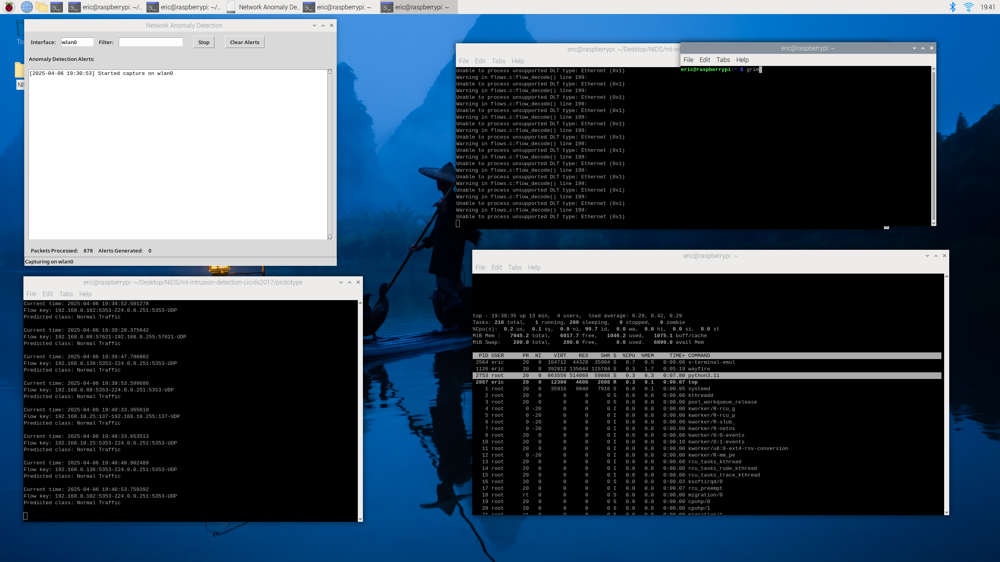
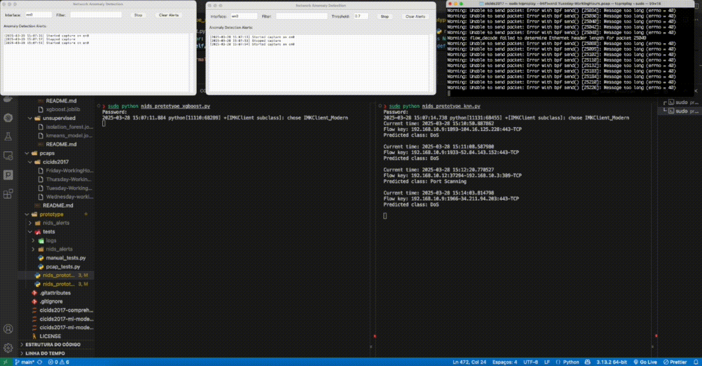

# Anomaly-Based NIDS for Resource-Constrained Networks using Machine Learning

This repository contains the code, documentation, and resources for my MBA's thesis project, "Anomaly-based intrusion detection in resource-limited networks." The project focuses on developing a practical Network Intrusion Detection System (NIDS) tailored for environments with limited computational resources, such as those found in small businesses or IoT deployments, typically utilizing devices like the Raspberry Pi. The research leverages the CICIDS2017 dataset for model training and initial evaluation, with a final prototype validated using real network traffic captures.

**View the Full Thesis (Soon)**

## Project Overview

The primary goal of this research was to explore and develop an effective, yet lightweight, machine learning-based NIDS suitable for deployment on resource-constrained hardware. Traditional NIDS solutions often demand significant processing power and memory, making them impractical for small businesses or edge devices. This project investigates various machine learning algorithms, ultimately developing a prototype that balances detection accuracy with operational efficiency.

A key finding of this research was the superior real-world applicability of instance-based learners like K-Nearest Neighbors (KNN) in dynamic network environments. While tree-based ensemble models like XGBoost demonstrated high accuracy on the curated CICIDS2017 dataset during training, the KNN model proved more adaptable and effective when an NIDS prototype was validated against replayed network traffic (pcap files) in a simulated production environment.

## Key Features

- **Resource-Constrained Focus:** The final NIDS prototype is designed with low-power devices like the Raspberry Pi 5 in mind, emphasizing minimal CPU and memory footprint during operation.
- **Anomaly-Based Detection:** Aims to identify deviations from normal network behavior, enabling the detection of both known and novel threats.
- **KNN-Powered Detection Core:** The operational NIDS prototype utilizes a K-Nearest Neighbors (KNN) model, chosen for its robust performance in simulated real-world traffic scenarios and its low computational overhead.
- **Real-time Traffic Analysis:** Employs `scapy` for live packet capture and feature extraction from network traffic.
- **User-Friendly Interface:** Includes a simple graphical user interface (GUI) built with Tkinter for starting/stopping the NIDS, viewing alerts, and monitoring basic statistics.
- **Practical Validation:** The NIDS prototype was validated by replaying real network traffic captures (CICIDS2017 pcap files) using `tcpreplay` in a controlled environment.
- **Structured Alert Logging:** Alerts generated by the NIDS are logged in CSV format for easy review and analysis.

## Project Stages

The project was conducted in the following stages:

1.  **Data Preprocessing and Exploratory Data Analysis (EDA):**

    - Comprehensive cleaning, transformation, and analysis of the CICIDS2017 dataset.
    - Steps included handling missing values, removing duplicates, feature engineering, class balancing (SMOTE and random undersampling), and feature scaling (RobustScaler).
    - Detailed in the Jupyter Notebook: `cicids2017-comprehensive-data-processing-for-ml.ipynb`.
    - The preprocessed [dataset is available on Kaggle](https://www.kaggle.com/datasets/ericanacletoribeiro/cicids2017-cleaned-and-preprocessed).

2.  **Machine Learning Model Training and Comparative Evaluation:**

    - Training and rigorous evaluation of various supervised (Random Forest, XGBoost, KNN) and unsupervised (Isolation Forest, K-Means) machine learning models.
    - Performance was assessed using metrics such as accuracy, precision, recall, F1-score, and resource consumption (training time, CPU/memory usage).
    - Hyperparameter tuning was performed using `RandomizedSearchCV`.
    - Jupyter Notebooks:
      - Supervised Models: `cicids2017-ml-models-comparison-supervised.ipynb` ([Kaggle Version](https://www.kaggle.com/code/ericanacletoribeiro/cicids2017-ml-models-comparison-supervised))
      - Unsupervised Models: `cicids2017-ml-models-comparison-unsupervised.ipynb` ([Kaggle Version](https://www.kaggle.com/code/ericanacletoribeiro/cicids2017-ml-models-comparison-unsupervised))

3.  **NIDS Prototype Development and Validation:**
    - Development of a functional NIDS prototype in Python, integrating the selected machine learning model (KNN) for its practical performance.
    - The `prototype/nids_prototype_knn.py` script contains the `NetworkAnomalyDetector` class for packet processing and feature extraction, and the `NetworkAnomalyGUI` class for the user interface.
    - The prototype was validated on a Raspberry Pi 5 by replaying CICIDS2017 pcap files using `tcpreplay` to simulate network attacks (e.g., DoS, Port Scan, Botnet). This method allowed for direct comparison against known traffic patterns.

<br>



## Repository Structure

```
├── ml_models/ # Trained machine learning models and scalers
│ ├── supervised/
│ │ ├── knn_model.joblib
│ │ └── ... (other supervised models)
│ ├── unsupervised/
│ │ └── ... (unsupervised models)
│ └── scalars/
│   ├── robust_scalar_supervised.joblib
│   └── robust_scalar_unsupervised.joblib
│
├── prototype/ # NIDS application code
│ ├── nids_knn.py # Main NIDS script with KNN model
│ ├── nids_xgboost.py # (Exploratory) NIDS script with XGBoost model
│ └── nids_alerts/ # Directory where alert logs are saved (created at runtime)
│
├── pcaps/ # (Optional) Directory for storing pcap files for testing
│   # Note: For CICIDS2017 pcaps, download from the official source.
│
│   # Jupyter Notebooks
├── cicids2017-comprehensive-data-processing-for-ml.ipynb
├── cicids2017-ml-models-comparison-supervised.ipynb
├── cicids2017-ml-models-comparison-unsupervised.ipynb
│
├── .gitignore
├── .gitattributes
├── LICENSE
└── README.md
```

## Getting Started

### Prerequisites

- Python 3.11+
- pip (Python package installer)
- `libpcap-dev` (or equivalent for your OS, required by Scapy for packet capture)
  - On Debian/Ubuntu: `sudo apt-get install libpcap-dev`
  - On Fedora: `sudo dnf install libpcap-devel`
  - On macOS (with Homebrew): `brew install libpcap`

### Installation

1.  **Clone the repository:**

    ```bash
    git clone https://github.com/anacletu/ml-intrusion-detection-cicids2017.git
    cd ml-intrusion-detection-cicids2017
    ```

2.  **Create and activate a virtual environment (recommended):**

    ```bash
    python3 -m venv venv
    source venv/bin/activate  # On Windows: venv\Scripts\activate
    ```

3.  **Install the required Python packages:**
    A `requirements.txt` file is not currently in the repository. You will need to install the dependencies manually or create a `requirements.txt` file. Key dependencies include:

    ```bash
    pip install pandas numpy scikit-learn joblib scapy netifaces tk
    ```

As soon as I have some time, I will add a requirements file with all the dependencies for easier reproduction.

### Running the NIDS Prototype (KNN-based)

The NIDS prototype requires root/administrator privileges to capture network packets.

1.  **Navigate to the prototype directory:**

    ```bash
    cd prototype
    ```

2.  **Run the NIDS script:**
    ```bash
    sudo python nids_prototype_knn.py
    ```
    The GUI will launch. You can select the network interface (it attempts to auto-detect the default) and start/stop packet capture. Alerts will be displayed in the GUI and logged to `prototype/nids_alerts/nids_alerts_knn.csv`.

### Testing the NIDS with PCAP Files

To test the NIDS with pre-recorded traffic (e.g., from the CICIDS2017 dataset):

1.  **Obtain PCAP files:** Download the original CICIDS2017 pcap files from the [Canadian Institute for Cybersecurity](https://www.unb.ca/cic/datasets/ids-2017.html). You might place them in a `pcaps/` directory within the project for organization.

2.  **Start the NIDS prototype** as described above. Ensure it's monitoring the correct interface. For `tcpreplay`, you might want it to monitor a loopback interface or a dedicated test interface if you are replaying traffic onto it. A common setup is to replay traffic out one interface and have the NIDS listen on another interface connected to the same network segment, or replay onto the same interface the NIDS is listening on (be cautious with this on a live network).

3.  **Use `tcpreplay` to send the pcap traffic.** Open a separate terminal.

- First, you might need to edit the pcap to match your test network's IP addresses if you are replaying onto a specific interface that the NIDS is listening on. `tcprewrite` can be used for this.
- To replay a pcap file (e.g., `Tuesday-WorkingHours.pcap`) onto a specific interface (e.g., `eth0`):

```bash
sudo tcpreplay -i eth0 Tuesday-WorkingHours.pcap
```

- The NIDS should detect and log anomalies present in the pcap file.

## Results and Discussion

The thesis details the performance of various models. While XGBoost achieved high accuracy (99.90%) on the curated CICIDS2017 training/test split, the KNN-based NIDS prototype demonstrated better adaptability and practical detection capabilities during live traffic simulation using `tcpreplay`. The KNN prototype, when run on a Raspberry Pi 5, consumed approximately 14% CPU and 6.3% of 8GB RAM during inference, confirming its suitability for resource-constrained environments.

For a comprehensive discussion of results, model performance metrics, and resource utilization, please refer to the full thesis document.



## Future Work

Based on the findings of this research, potential avenues for future work include:

- **Real-World Deployment and Evaluation:** Deploy the NIDS in a more realistic, externally exposed network environment (e.g., with a public IP) to assess its performance against WAN-originated attacks and diverse traffic patterns.
- **Binary Classification Refinement:** Simplify the classification task to a binary (attack vs. non-attack) problem. This could mitigate issues with misclassification of specific attack types due to signature overlaps and improve overall robustness in operational scenarios.
- **Cross-Dataset Generalization:** Apply feature engineering techniques and evaluate model performance on other benchmark NIDS datasets (e.g., UNSW-NB15, CSE-CIC-IDS2018) to assess generalization capabilities and identify limitations of models trained exclusively on CICIDS2017.
- **Exploration of Advanced Algorithms:** Given the low resource consumption of the KNN prototype during inference, investigate more complex algorithms like Deep Neural Networks (DNNs) that might offer enhanced abstraction and detection of subtle malicious patterns, while still being manageable on target hardware.
- **Enhanced Feature Engineering:** Continuously refine feature engineering by incorporating data from diverse sources or exploring more sophisticated temporal features to improve detection accuracy and reduce false positives.

## License

This project is licensed under the MIT License - see the [LICENSE](LICENSE) file for details.
